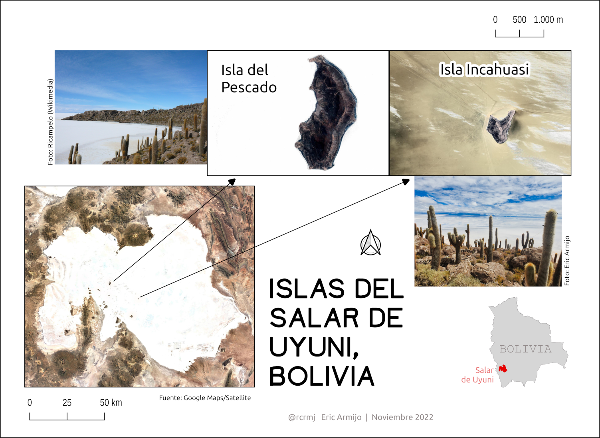

# 🌍 Desafío de Mapa de 30 Días (30 Day Map Challenge) 2022

Este repositorio almacena mis contribuciones y algún código al #30DayMapChallenge del año 2022.
En la preparación de los mapas se utilizó diferentes herramientas (en orden de importancia): QGIS, R, LibreOffice Impress 

> El [#30DayMapChallenge](https://github.com/tjukanovt/30DayMapChallenge) sigue las guías definidas por Topi Tjukanov

---

## 📊 Contribuciones

| Categoría             |  Ejemplo |
:-------------------------:|:-------------------------:
[Día 1: Puntos]  |  
[Día 2: Líneas]  |  
[Día 3: Polígonos]  |  
[Día 4: Viernes color: Verde]  |  
[Día 5: Ucrania]  |  
[Día 6: Red](codigo/d06/bol_flight_connection_map_gral.R)  |  
[Día 7: Ráster]  |  
[Día 8: Datos: OpenStreetMap]  |  
[Día 9: Espacio]  |  
[Día 10: Un mal mapa]  |  
[Día 11: Viernes color: Rojo]  |  
[Día 12: Escala]  |  
[Día 13: Mapa 5 minutos]  |  
[Día 14: Hexágonos]  |  
[Día 15: Comida/bebida]  |  
[Día 16: Mínimo]  |  
[Día 17: Sin computadora]  |  
[Día 18: Viernes color: Azul]  |  
[Día 19: Globo]  |  
[Día 20: Mi...favorito]  |  
[Día 21: Datos: Kontur population]  |  
[Día 22: NULO]  |  
[Día 23: Movimiento]  |  
[Día 24: Fantasía]  |  
[Día 25: Viernes color: 2 colores]  |  
[Día 26: Isla(s)]  |  
[Día 27: Música]  |  
[Día 28: 3D]  |  
[Día 29: Fuera de mi zona de confort]  |  
[Día 30: Remezcla]  |  
