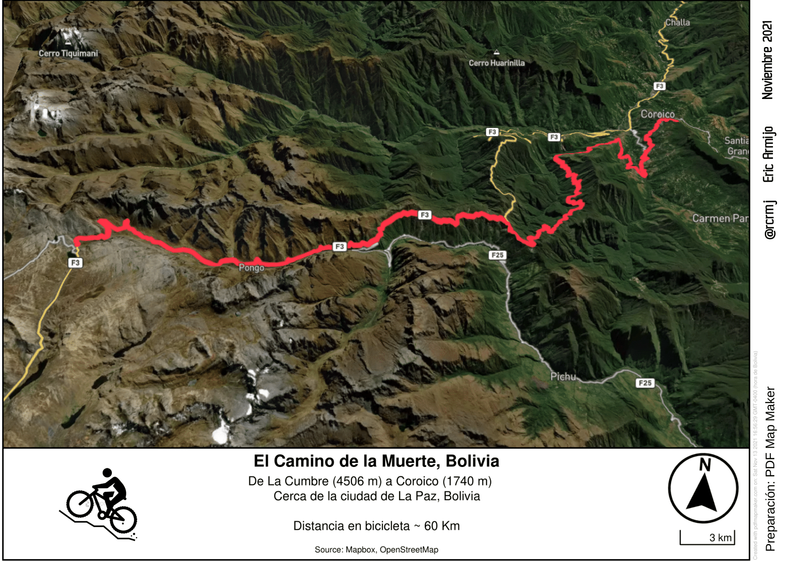

# 30-day-map-challenge
Un repositorio de mi participación en el #30DayMapChallenge del 2021

---

## 📊 Contribuciones

| Categoría             |  Ejemplo |
:-------------------------:|:-------------------------:
[Día 1: Puntos]()  |  
[Día 2: Líneas]()  |  
[Día 3: Polígonos]()  |  
[Día 4: Hexágonos]()  |  
[Día 5: OpenStreetMap]()  |  
[Día 6: Rojo]()  |  
[Día 7: Verde]()  |  
[Día 8: Azul]()  |  
[Día 9: Monócromo]()  |  
[Día 10: Ráster]()  |  
[Día 11: 3D]()  |  
[Día 12: Población]()  |  
[Día 13: Natural Earth]()  |  
[Día 14: Nueva herramienta]()  |  
[Día 15: Sin computadora]()  |  
[Día 16: Urbano/rural]()  |  
[Día 17: Tierra]()  |  
[Día 18: Agua]()  |  
[Día 19: Isla]()  |  
[Día 20: Movimiento]()  |  
[Día 21: Elevación](notebooks/20_Movement.ipynb)  |  
[Día 22: Límites](notebooks/20_Movement.ipynb)  |  
[Día 23: GHSL](notebooks/20_Movement.ipynb)  |  
[Día 24: Mapa histórico](notebooks/20_Movement.ipynb)  |  
[Día 25: Mapa interactivo](notebooks/20_Movement.ipynb)  |  
[Día 26: Mapa coroplético](notebooks/20_Movement.ipynb)  |  
[Día 27: Mapa de calor](notebooks/20_Movement.ipynb)  |  
[Día 28: La Tierra no es plana](notebooks/20_Movement.ipynb)  |  
[Día 29: NULO](notebooks/20_Movement.ipynb)  |  
